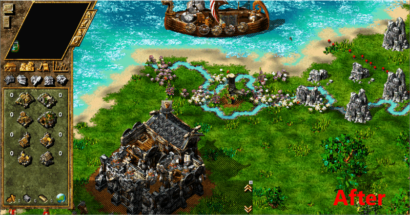

# The Settlers 4: Terrain Texture Changer

This ASI mod will make every map appear in the new world textures - even the old maps. 

There is a [German translation for this README](README_DE.md). Please note that it may be outdated.

This mod is an ASI repack of the well known Cybertom's Texture Swapper. Though the ASI mod works slightly different and does not require you to alter any game files.

## Features

* Force the new world terrain textures on every map you play!
* No game files are altered on your hard drive.
* Compatibility: Works with the Gold Edition and the History Edition of The Settlers 4 and even with the map editors of both versions.
* Multiplayer interoperability: You can play multiplayer with participants that do not use this mod.
* Open Source: Most parts of the project including patterns, offsets, enums and structs are open source!

## How to use

You need an ASI Loader to use this mod. I recommend [The Settlers 4: ASI Loader](https://github.com/nyfrk/Settlers4-ASI-Loader) as it works nicely with the Gold and History Edition of The Settlers 4 and does not require any configuration. If you already have an ASI loader installed skip the first steps and jump directly to step 5. 

1. Navigate to your installation directory of your game.
2. Find a file named `binkw32.dll` and rename it to `binkw32Hooked.dll`. (For the Gold Edition it is in a subdirectory named `Exe`)
3. [Download a release of the Settlers 4 ASI Loader](https://github.com/nyfrk/Settlers4-ASI-Loader/releases) and unpack the `binkw32.dll` to the very same directory.
4. Create a `plugins` directory next to your `S4_Main.exe`
5. [Download a release of the Settlers 4 Terrain Texture Changer Mod](https://github.com/nyfrk/Settlers4-TextureChanger/releases). Unpack the `S4_TerrainTexturesChanger.asi`  to the `plugins` directory. 
6. Start the game. The mod will load automatically.

To uninstall the mod remove `S4_TerrainTexturesChanger.asi` from the `plugins` directory. If you do not want to use the ASI loader anymore just reverse the described steps. 

## Known Problems

* You must have a game version that has the new world textures included. You to have at least the add-on *The Settlers IV: The New World* or the History Edition of the game. 

## Issues and Questions

The project uses the Github Issue tracker. Please open a ticket [here](https://github.com/nyfrk/Settlers4-TextureChanger/issues). 

## Contribute

The official repository of this project is available at https://github.com/nyfrk/Settlers4-TextureChanger. You can contribute in the following ways:

* Answer questions
* Submit bugs or help to verify them
* Review code and test the proposed fixes
* Submit pull requests

#### Compile it yourself

Download Visual Studio 2017 or 2019 with the C++ toolchain. The project is configured to build it with the Windows XP compatible **v141_xp** toolchain. However, you should be able to change the toolchain to whatever you like. No additional libraries are required so it should compile out of the box.

#### Developers

The *New World* textures are packed in the GFX/41.\* files. The classic textures are stored in the GFX/2.\* files. This mod will simply redirect all file access from the later to the former thus tricking the game into always loading the new world textures even if it wanted to load the classic texture pack. If you do not have *The Settlers IV: The New World* add on installed, the game will not work as it will not be able to find the GFX/41.\* files. In that case ask a friend that has the expansion pack to send you a copy of the GFX/41.\* files. The mod should also work with the map editors since it hooks the Windows natives for opening files.

#### Future Work

* Allow players to force New World Maps to use the old textures
* Allow for more customization of the terrain textures (ie user defined texture packs)

## License

The project is licensed under the [MIT](LICENSE.md) License. 

## Acknowledgments

Special thanks to Cybertom for the original tool from 2003 (though I could not find any source code) and to [Settlermania](https://settlermania.wordpress.com/2013/07/11/texture-swapper-for-tropical-textures/) for conserving this tool to the public even after the initial website went offline. 