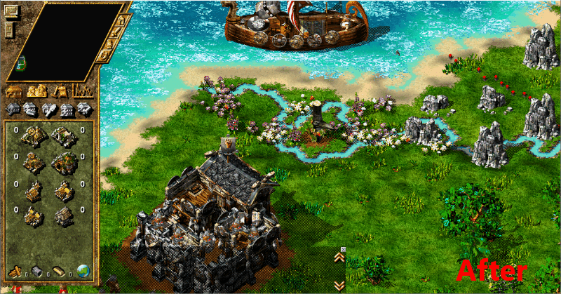

# Siedler 4: Texturenwechsler ASI Mod

Mit dem Add-On *The Settlers IV: The New World* wurde ein neues Terraintexturenpack dem Spiel hinzugefügt. Mit diesem Mod wird es in jeder Karte verwendet - auch in den klassischen Karten, die eigentlich gar nicht dafür vorgesehen sind.

Für dieses README gibt es eine [englische Version](README.md). Bitte beachte, dass die deutsche Übersetzung ggf. veraltet sein kann.

Diese Mod ist ein ASI-Repack des bekannten Texturenwechslers von Cybertom. Allerdings funktioniert die ASI-Mod etwas anders und erfordert daher keine Änderungen an den Spieldateien.

## Features

* Erzwinge die *Neue Welt* Texturen auf jeder Karte, die Du spielst!
* Es werden keine Spieldateien verändert.

* Kompatibilität: Die Mod läuft sowohl mit der Gold Edition als auch der History Edition von Die Siedler 4 und sogar mit den Karteneditoren beider Editionen.
* Mehrspieler-Interoperabilität: Du kannst im Mehrspieler-Modus mit Teilnehmern spielen, die diesen Mod nicht verwenden.
* Open Source: Die meisten Teile des Projekts, einschließlich Muster, Offsets, Enums und Structs sind quelloffen!

## Installation

Du benötigst einen ASI Loader um die Mod zu nutzen. Ich empfehle den [The Settlers 4: ASI Loader](https://github.com/nyfrk/Settlers4-ASI-Loader), da er gut mit der Gold und History Edition von Die Siedler 4 funktioniert und keinerlei Konfiguration erfordert. Wenn Du bereits einen ASI-Loader installiert hast, überspringe die ersten Schritte und fahre direkt mit Schritt 5 fort.

1. Navigiere zum Installationsverzeichnis des Spiels.
2. Suche eine Datei namens `binkw32.dll` und benennen sie in `binkw32Hooked.dll` um. (Bei der Gold Edition befindet sie sich in einem Unterverzeichnis namens `Exe`)
3. Lade ein [Release des ASI Loaders](https://github.com/nyfrk/Settlers4-ASI-Loader/releases) herunter und entpacke die `binkw32.dll` in dasselbe Verzeichnis.
4. Erstellen ein Verzeichnis namens `plugins` neben der `S4_Main.exe`.
5. Lade eine Version des [Texturenwechsler Mods](https://github.com/nyfrk/Settlers4-TextureChanger/releases) herunter. Entpacke die Datei `S4_TerrainTexturesChanger.asi` in das Verzeichnis `plugins`. 
6. Starte das Spiel. Die Mod sollte nun automatisch geladen werden.

Um die Mod zu deinstallieren, entferne die `S4_TerrainTexturesChanger.asi` aus dem `plugins`-Verzeichnis. Wenn Du den ASI-Loader nicht mehr verwenden möchtest, kannst Du einfach alle Schritte wieder rückgängig machen. 

## Bekannte Probleme

* Du musst eine Spielversion haben, die die Neuen-Welt Texturen enthält. Dazu muss mindestens das Add-on *Die Siedler IV: Die neue Welt* oder die History Edition des Spiels vorhanden sein. 

## Probleme und Fragen

Das Projekt verwendet den Github Issue Tracker. Bitte öffne [hier](https://github.com/nyfrk/Settlers4-TextureChanger/issues) ein Ticket für dein Anliegen. 

## Mitmachen

Das offizielle Repository dieses Projekts ist unter https://github.com/nyfrk/Settlers4-TextureChanger verfügbar. Du kannst auf die folgenden Arten einen Beitrag leisten:

* Beantworte Fragen
* Fehler melden oder bei der Verifizierung dieser helfen
* Code sichten und die vorgeschlagenen Korrekturen testen
* Pull Requests einreichen

#### Kompilieren

Lade Visual Studio 2017 oder 2019 mit der C++-Toolchain herunter. Das Projekt ist so konfiguriert, dass es mit der Windows XP-kompatiblen **v141_xp**-Toolchain gebaut wird. Du solltest jedoch die Toolchain nach Belieben ändern können. Es sind keine zusätzlichen Bibliotheken erforderlich, sodass das Projekt ohne weiteres gebaut werden kann. 

#### Entwickler

Die *New World*-Texturen sind in den GFX/41.\*-Dateien gespeichert. Die klassischen Texturen sind in den GFX/2.\*-Dateien gespeichert. Diese Mod leitet einfach alle Dateizugriffe von den letzteren auf die ersteren um und trickst das Spiel so aus, dass es immer die Texturen der neuen Welt lädt, auch wenn es das klassische Texturpaket angefordert hat. Wenn Du das Addon *Die Siedler IV: Die Neue Welt* nicht installiert hast, wird das Spiel nicht funktionieren, da es die GFX/41.\*-Dateien nicht finden kann. Bitte in diesem Fall einen Freund, der das Add On hat, Dir eine Kopie der GFX/41.\*-Dateien zu schicken. Der Mod sollte auch mit den Karteneditoren funktionieren, da er die Windows-Natives zum Öffnen von Dateien hooked.

#### Zukünftige Arbeit

* Erlaube Spielern, die neuen klassischen Texturen auch in Neue-Welt Karten zu erzwingen.
* Erlaube benutzerdefinierte Terraintexturenpacks

## Lizenz

Das Projekt ist unter der [MIT](LICENSE.md)-Lizenz lizenziert. 

## Danksagungen

Special thanks to Cybertom for the original tool from 2003 (though I could not find any source code) and to [Settlermania](https://settlermania.wordpress.com/2013/07/11/texture-swapper-for-tropical-textures/) for conserving this tool to the public even after the initial website went offline. 